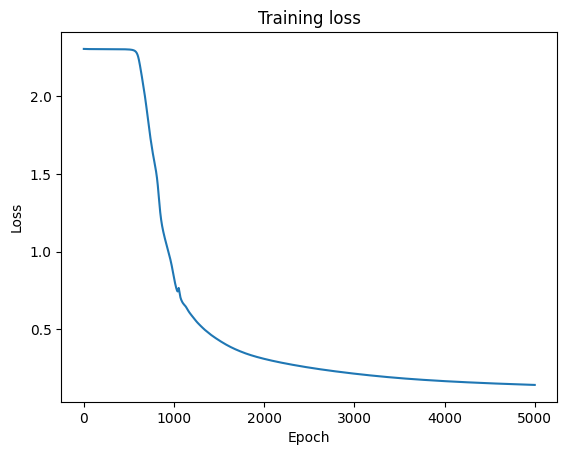
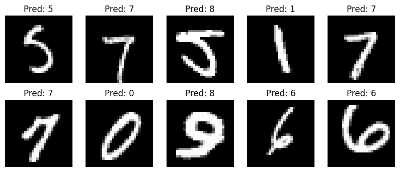

# MNIST Neural Network from Scratch (NumPy)

This repository implements a fully-connected feedforward neural network trained on the MNIST handwritten digits dataset using only NumPy. No high-level machine learning libraries are used for the network itself. All forward propagation, backpropagation, and gradient descent are implemented manually.

## Architecture

```
Input (784) -> Hidden Layer 1 (16, ReLU) -> Hidden Layer 2 (16, ReLU) -> Output (10, Softmax)
```

| Property | Value |
|---|---|
| Input dimension | 784 (28x28 flattened) |
| Hidden layers | 2 x 16 neurons |
| Activations | ReLU (hidden), Softmax (output) |
| Loss | Categorical cross-entropy |
| Optimizer | Batch gradient descent |
| Learning rate | 0.1 |
| Epochs | 5000 |
| Training accuracy | ~95.8% |
| Test accuracy | ~95.0% |

## Theoretical Background

### Data Representation

Each MNIST image is a 28x28 grayscale image, flattened into a column vector $\mathbf{x} \in \mathbb{R}^{784}$. For a dataset of $m$ samples, the input matrix is:

$$X \in \mathbb{R}^{784 \times m}$$

Pixel values are normalized to $[0, 1]$ by dividing by 255.

### Forward Propagation

The network computes activations layer by layer. For each layer $l$, a linear transformation is followed by a nonlinear activation:

**Layer 1:**

$$Z^{[1]} = W^{[1]} X + b^{[1]}, \quad A^{[1]} = \text{ReLU}(Z^{[1]})$$

where $W^{[1]} \in \mathbb{R}^{16 \times 784}$ and $b^{[1]} \in \mathbb{R}^{16 \times 1}$.

**Layer 2:**

$$Z^{[2]} = W^{[2]} A^{[1]} + b^{[2]}, \quad A^{[2]} = \text{ReLU}(Z^{[2]})$$

where $W^{[2]} \in \mathbb{R}^{16 \times 16}$ and $b^{[2]} \in \mathbb{R}^{16 \times 1}$.

**Output Layer:**

$$Z^{[3]} = W^{[3]} A^{[2]} + b^{[3]}, \quad \hat{Y} = A^{[3]} = \text{softmax}(Z^{[3]})$$

where $W^{[3]} \in \mathbb{R}^{10 \times 16}$ and $b^{[3]} \in \mathbb{R}^{10 \times 1}$.

### Activation Functions

**ReLU (Rectified Linear Unit)**

ReLU introduces nonlinearity and is applied elementwise:

$$\text{ReLU}(z) = \max(0, z)$$

Its derivative is used during backpropagation:

$$\text{ReLU}'(z) = \begin{cases} 1 & \text{if } z > 0 \\ 0 & \text{otherwise} \end{cases}$$

ReLU is preferred over sigmoid in hidden layers because it does not saturate for positive inputs, which avoids the vanishing gradient problem.

**Softmax**

Softmax converts raw logits into a probability distribution over 10 classes. For class $k$:

$$\text{softmax}(z_k) = \frac{e^{z_k}}{\displaystyle\sum_{j=1}^{10} e^{z_j}}$$

The implementation subtracts $\max(\mathbf{z})$ before exponentiating for numerical stability:

$$\text{softmax}(z_k) = \frac{e^{z_k - \max(\mathbf{z})}}{\displaystyle\sum_{j=1}^{10} e^{z_j - \max(\mathbf{z})}}$$

This subtraction does not change the output mathematically but prevents floating-point overflow.

### Loss Function

The network is trained with categorical cross-entropy loss. Given the one-hot encoded ground truth $Y \in \{0,1\}^{10 \times m}$ and the predicted probabilities $\hat{Y} \in (0,1)^{10 \times m}$:

$$\mathcal{L} = -\frac{1}{m} \sum_{i=1}^{m} \sum_{k=1}^{10} Y_k^{(i)} \log \hat{Y}_k^{(i)}$$

Since $Y$ is one-hot, only the log probability of the correct class contributes to the sum for each example:

$$\mathcal{L} = -\frac{1}{m} \sum_{i=1}^{m} \log \hat{Y}_{y^{(i)}}^{(i)}$$

A small constant $\varepsilon = 10^{-9}$ is added inside the logarithm to prevent $\log(0)$.

### Backpropagation

Backpropagation computes gradients of the loss with respect to all parameters by applying the chain rule layer by layer in reverse order.

**Output layer gradient**

The combination of softmax and cross-entropy yields a particularly clean gradient. The error signal at the output is:

$$\delta^{[3]} = A^{[3]} - Y \in \mathbb{R}^{10 \times m}$$

The weight and bias gradients for layer 3 are:

$$\frac{\partial \mathcal{L}}{\partial W^{[3]}} = \frac{1}{m}\, \delta^{[3]} (A^{[2]})^\top, \qquad \frac{\partial \mathcal{L}}{\partial b^{[3]}} = \frac{1}{m} \sum_{i=1}^{m} \delta^{[3](i)}$$

**Hidden layer 2 gradient**

The error is propagated back through $W^{[3]}$ and gated by the ReLU derivative:

$$\delta^{[2]} = (W^{[3]})^\top \delta^{[3]} \odot \text{ReLU}'(Z^{[2]})$$

where $\odot$ denotes elementwise multiplication. The gradients are:

$$\frac{\partial \mathcal{L}}{\partial W^{[2]}} = \frac{1}{m}\, \delta^{[2]} (A^{[1]})^\top, \qquad \frac{\partial \mathcal{L}}{\partial b^{[2]}} = \frac{1}{m} \sum_{i=1}^{m} \delta^{[2](i)}$$

**Hidden layer 1 gradient**

$$\delta^{[1]} = (W^{[2]})^\top \delta^{[2]} \odot \text{ReLU}'(Z^{[1]})$$

$$\frac{\partial \mathcal{L}}{\partial W^{[1]}} = \frac{1}{m}\, \delta^{[1]} X^\top, \qquad \frac{\partial \mathcal{L}}{\partial b^{[1]}} = \frac{1}{m} \sum_{i=1}^{m} \delta^{[1](i)}$$

### Gradient Descent

Parameters are updated after each full pass over the training data (batch gradient descent):

$$W^{[l]} \leftarrow W^{[l]} - \alpha \frac{\partial \mathcal{L}}{\partial W^{[l]}}$$

$$b^{[l]} \leftarrow b^{[l]} - \alpha \frac{\partial \mathcal{L}}{\partial b^{[l]}}$$

where $\alpha = 0.1$ is the learning rate. Using the full batch makes the gradient estimates low-variance at the cost of slower iteration cycles compared to mini-batch or stochastic gradient descent.

### Weight Initialization

Weights are initialized from a zero-mean Gaussian scaled by $0.01$:

$$W^{[l]} \sim \mathcal{N}(0,\, 0.01^2)$$

Small initialization prevents large initial activations from saturating nonlinearities and keeps the early gradient signal well-behaved. Biases are initialized to zero.

## Results

### Training Loss

The loss drops sharply after roughly 750 epochs, indicating the network has found a useful gradient signal. It continues to decrease gradually toward convergence.



### Sample Predictions

Ten images are drawn randomly from the test set. The model achieves 95% test accuracy; occasional misclassifications occur on ambiguous or atypically written digits (for example, a handwritten 9 that the model predicts as 8).



## Dependencies

```bash
pip install -r requirements.txt
```

## For NixOS Users:
```bash
nix develop
```
